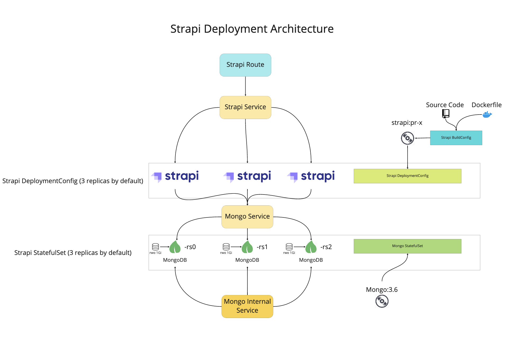
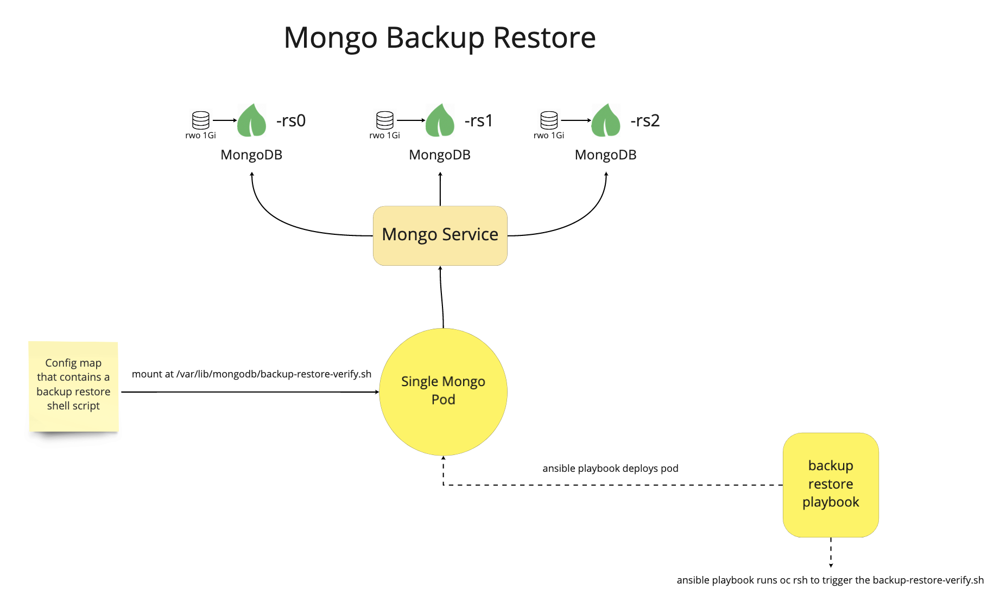

# Strapi-Mongo Code Challenge Submission

This repo represents a two tier sytem that is composed of __Strapi__, a `headless CMS`, and __MongoDB__, a noSQL database. Both components have been architected for _High Availability_. 

- Strapi: 3 replica deployment config
- Mongo: 3 replica statefulset (mongo replicaset)

## Quick Start Guide
Check out the [ansible docs](ansible/README.md) for all available playbooks. 

To build and deploy strapi perform these steps:

1. Open a PR (take not of PR num)
2. Build Strapi using the `build-strapi.yaml` playbook
3. Run the `deploy-mongo.yaml` playbook
4. Run the `deploy-strapi.yaml` playbook when image is available and mongo is ready

## Application Build and Deployment

The application build and deployments (onto Openshift) leverage several technologies to streamline the process.

- ansible `ansible`
- openshift templates `openshift/templates`

Together they deploy an instance of [Strapi](https://strapi.io) which is a Opensource headless CMS. 

A Running version of the application can be found here http://strapi-pr-5-va3azs-patricksimonian-ocp201-tst-dev.pathfinder.gov.bc.ca/

## Pull Request Based Deployments

This application (and its automation) leverages `Github Flow`  (more info [here](https://guides.github.com/introduction/flow/)). 

### TL;DR

- Open Pull requests are utilzized as points to build and deploy code from
- Pull requests are not closed until they reach a prod like environment (for our cases this would be the dev namespace)
- You will require an __OPEN PR__ in order to utilize the ansible playbooks to build and deploy this application.

### Openshift Templates

There are a heavy use of Openshift Templates. I opted not to leverage tempaltes within ansible jinja templates so that they could be kept seperate and the templates run standalone. 

#### Labeling

All components have a set of labels to organize seperate PR based deployments as well an easy way to group them up for cleaning. 

- app: identifies a label for a group of objects that belong to a Pull request. This includes the instance name plus a suffix. Such as `strapi-pr-3` and `mongo-pr-3`

- group: a generic label to get/delete all versions of an instance. Such as `strapi` and `mongo`

- pr: identifies all objects that share the same Pull Request (allows you to grab strapi and mongo objects to gether)

### Structure

## Operational Plan

The operational plan describes the process for backing up and testing a restore of the mongo replicaset. 

### Thought Process

The backup restore process is totally new to me and was indeed a big learning point. My mantra was

`make it simple -> make it work -> make it right -> make it better`

I comforatably covered up to `make it work`. My hope is to transfer the pod template into a cron job. This would require modification of the backup playbook to not delete the pod as a final task. 

### Performing a Strapi Upgrade

1. Rebuild Strapi Image to latest version based off the build playbook *
2. Perform Backup and Restore check of database *
3. Redeploy Strapi and Mongo *
4. Verify readiness and health of both services
5. If Mongo is unhealthy scale both services down
6. Restore Mongo
7. Bring back up Mongo and Strapi and verify again

> *  means playbooks exist, a missing * means a playbook needs to be written for these steps

#### Reducing Service Disruption

There are two ways that I'd reduce service disruption

1. Perform upgrades outside of business hours
2. Perform a blue-green deployment (this would be preferred)

## Todos

- combine strapi and mongo playbooks together
